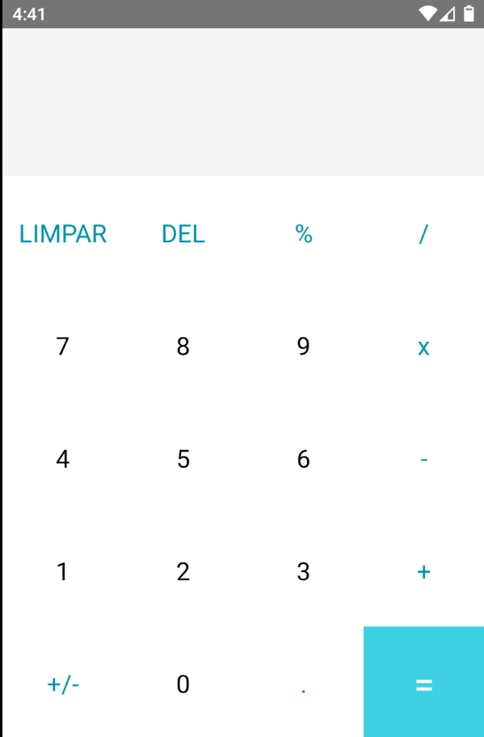

# Calculadora em react-native
Aplicativo de Calculadora simples em react-native
## Screenshot

## Instalação

1. Clone esse repositório ou faça o download dos arquivos
2. Abra o projeto no Visual Studio Code
3. Abra o Terminal e execute o comando npm install para instalar os módulos do Node.
4. Execute o projeto com react-native run-android

